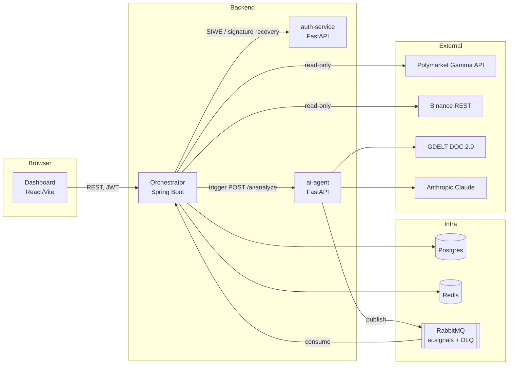

# PolyPilot

[](https://github.com/luigi-bozzoli/polypilot/actions/workflows/ci.yml)

A self-hosted paper-trading platform for [Polymarket](https://polymarket.com) prediction markets. It syncs real,
read-only market data, computes technical indicators on the underlying asset, evaluates user-defined rule-tree
strategies on a schedule, and layers in LLM-generated news sentiment — all against **simulated fills**, never a
real order.

**This is not financial advice, and it does not place real trades.** Order execution against Polymarket is
intentionally not implemented (see [Known limitations](#known-limitations)). Simulated fills use cached prices
from the last sync, not a live orderbook, so backtested-looking performance from this system will overstate what
a real execution could achieve — slippage, latency, and partial fills don't exist here.


## Live demo

https://luigi-bozzoli.github.io/polypilot/

A static build of the dashboard with **no backend at all** — every API call is answered in-browser by
[MSW](https://mswjs.io/) from typed fixtures, deployed to GitHub Pages from `main` (`.github/workflows/demo.yml`).

- **All data is simulated** — fixture series/markets/orders/positions/audit logs, deterministic and re-generated
  fresh on every load. Values aren't meant to be realistic, just internally consistent.
- **Both logins are simulated** — the password form accepts any input, and "Connect Wallet" fakes a wallet
  connection and signature; no real wallet, extension, or network call is involved either way.
- **Strategies are the one stateful piece** — create, edit, delete and enable/disable all work, in memory,
  and reset to the 3 seeded strategies on reload. Nothing else is stateful.
- **Not simulated**: placing a live order, closing a position, and enabling live trading stay permanently
  disabled — same as in the real app, since that Polymarket integration is deprecated/frozen (see
  [Known limitations](#known-limitations)).

Run it locally:

```bash
cd dashboard
npm run dev:demo                        # http://localhost:5173, demo mode, base path '/'
BASE_PATH=/polypilot/ npm run build:demo && npm run preview:demo -- --port 4173 --strictPort
```

How it works: a `VITE_DEMO=true` build (`vite --mode demo` / `vite build --mode demo`) swaps a handful of
real modules (the wallet login panel, the password form, the wagmi config) for demo-only replacements via
`vite.config.ts`'s `resolve.alias`, and boots an MSW browser worker from `src/main.tsx` before the first
render. None of this reaches a real build: `scripts/check-bundle.mjs` fails CI if the demo marker or MSW's
worker script ever leaks into `dist/` from `npm run build`. Full details: `dashboard/src/demo/README.md`.

## Features

All of the below is implemented and exercised by the test suite, not aspirational:

- **Market & series sync** — read-only polling of Polymarket's Gamma API for series/market discovery and price
  refresh, with full price-snapshot history on every observed change.
- **Technical indicators** — Binance OHLC candle ingestion (`ohlc-sync`) feeding a ta4j-based calculator
  (SMA, EMA, RSI, MACD, ATR, volume MA), computed on demand, config-driven via a DB catalog.
- **Rule-tree strategy engine** — a small JSON DSL combining indicator comparisons, market-field comparisons, and
  boolean logic, evaluated on its own per-strategy cron schedule.
- **Simulated (dry-run) trading** — a triggered strategy opens a simulated position against the strategy's
  `dry_run`/sizing/stop-loss settings, recorded in `orders`/`positions`; every run — triggered or not — writes an
  audit-log entry.
- **News sentiment** — GDELT-sourced headlines summarized and scored (BULLISH/BEARISH/NEUTRAL + confidence) by a
  single Claude call, published over RabbitMQ and consumed back into the same market rows the strategy engine
  reads for sentiment-gated conditions.
- **Audit log** — every strategy evaluation (and any resulting simulated order) is recorded and browsable from
  the dashboard.
- **React dashboard** — overview, per-series/market detail with OHLC and news/sentiment, strategy builder and
  detail pages, a system health page, all behind SIWE or password login.

## Architecture



The orchestrator is the only service with a database and the only one that enforces authorization; it owns
every write. `auth-service` does cryptographic verification only (SIWE signature recovery) — it holds no
session state and makes no policy decisions. `ai-agent` has no database of its own; the orchestrator passes it
the market context it needs and picks up the result asynchronously. The async boundary is deliberate: order/data
writes are synchronous HTTP because the caller needs the result immediately, while the AI sentiment pipeline is
fire-and-forget over RabbitMQ because nothing blocks on it. A malformed or unprocessable `ai.signals` message is
retried a bounded number of times, then dead-lettered to `ai.signals.dlq` rather than crashing the consumer.

## Tech stack

| | |
|---|---|
| **Orchestrator** | Java 21, Spring Boot 4.1, Spring Security (JWT), Spring Data JPA, ta4j, ShedLock, Maven |
| **auth-service** | Python 3.12, FastAPI, web3.py / eth-account |
| **ai-agent** | Python 3.12, FastAPI, LangChain (Anthropic), pika |
| **Dashboard** | React 18, TypeScript, Vite, TanStack Query, wagmi/viem, Tailwind |
| **Infra** | PostgreSQL 16, Redis 7, RabbitMQ 3, Docker Compose |

## Quick start

```bash
git clone https://github.com/luigi-bozzoli/polypilot.git && cd polypilot
./scripts/init-env.sh        # creates .env with generated secrets
# then open .env and set ANTHROPIC_API_KEY (required for news sentiment)
docker compose up --build
```

| Service | URL |
|---|---|
| Dashboard | http://localhost:5173 |
| Orchestrator API | http://localhost:8080 |
| RabbitMQ management UI | http://localhost:15672 |

Two seeded accounts work out of the box (`orchestrator/src/main/resources/sql/002_seed_data.sql`, re-applied
idempotently on every boot — see [Known limitations](#known-limitations)):

| Account | Email | Password | Role |
|---|---|---|---|
| Admin | `admin@polypilot.local` | `password` | `ADMIN` |
| Demo | `demo@polypilot.local` | `password` | `USER` |

Change both before exposing this anywhere reachable by anyone else. Wallet login (Sign-In With Ethereum) works
too — see `dashboard/README.md`.

### Production-like run

```bash
docker compose -f docker-compose.prod.yaml up --build
```

Builds every service's production image (non-root, no hot reload) and publishes **only** the dashboard
(`http://localhost:8081` by default) — Postgres, Redis, RabbitMQ and all three backend services stay on the
internal Docker network. Requires the same `.env` as above.

## Configuration

Generated by `./scripts/init-env.sh`; the full list with defaults lives in `.env.example`.

| Variable | Required | Purpose |
|---|---|---|
| `JWT_SECRET` | yes | HMAC key for signing JWTs (base64, ≥32 bytes). Orchestrator fails fast on a missing, too-short, or known-placeholder value. |
| `ENCRYPTION_KEY` | yes | AES-256 key for wallet credentials at rest (base64, 32 bytes). |
| `DB_USER` / `DB_PASSWORD` | yes | PostgreSQL credentials. |
| `RABBITMQ_USER` / `RABBITMQ_PASSWORD` | yes | RabbitMQ credentials. |
| `ANTHROPIC_API_KEY` | yes (for sentiment) | Claude API key; without it, sentiment runs still complete but degrade to a neutral, zero-confidence result. |
| `AI_AGENT_MODEL` | no | Overrides the sentiment model (default `claude-haiku-4-5-20251001`). Check [Anthropic's model deprecation page](https://platform.claude.com/docs/en/about-claude/model-deprecations) before changing it — a retired model's API error is silently absorbed into the same neutral-result path as "no news found." |
| `POLYMARKET_PRIVATE_KEY` | no | Deprecated/frozen — the disabled ClobAuth relay path never reads it; only `auth-service`'s `/health` reads it, to report whether it's configured. Leave blank. |
| `VITE_WALLETCONNECT_PROJECT_ID` | no | Mobile-wallet SIWE login via [WalletConnect](https://cloud.walletconnect.com). Browser-extension wallets work without it. Baked in at dashboard build time, not read at runtime. |

## Testing

```bash
# orchestrator — unit tests (Surefire)
docker run --rm -v "$PWD/orchestrator:/app" -w /app maven:3.9-eclipse-temurin-21 mvn test

# orchestrator — unit + Testcontainers integration tests (needs Docker)
docker run --rm -v "$PWD/orchestrator:/app" -v /var/run/docker.sock:/var/run/docker.sock \
  -w /app maven:3.9-eclipse-temurin-21 mvn verify

# ai-agent / auth-service
cd ai-agent && pip install -r requirements.txt -r requirements-dev.txt && pytest
cd auth-service && pip install -r requirements.txt -r requirements-dev.txt && pytest

# dashboard — type-check + build
cd dashboard && npm ci && npm run build
```

297 orchestrator unit tests, 4 Testcontainers integration tests (real Postgres + RabbitMQ, covering the AI signal
pipeline end to end and a security regression check), a real pytest suite for ai-agent, and 10 auth-service
tests — all offline except the orchestrator's integration suite, which needs Docker.

## Design notes

- **Async boundary** (ADR-003): order/data-critical calls are synchronous HTTP; AI sentiment is
  fire-and-forget over RabbitMQ. Keep new cross-service calls on the correct side of this split.
- **ShedLock-guarded scheduling**: each strategy runs on its own cron trigger (not a shared sweep), leased via a
  DB-backed lock so a slow evaluation can't overlap its own next tick — and so the orchestrator stays safe to run
  as more than one instance later, even though it's single-instance only today.
- **Rule-tree DSL**: strategies compose indicator/market-field comparisons and boolean logic as a small JSON
  tree, not a fixed set of strategy "types" — new comparison operators or indicators plug into existing nodes.
- **Audit trail**: every scheduled strategy evaluation writes at least one `audit_logs` row (two if it opens a
  simulated position), so "why didn't/did this fire" is always answerable from the DB, not just logs.

## Known limitations

- **Paper trading only.** No integration places, cancels, or reads real orders against Polymarket. The
  `wallet/`/ClobAuth credential-derivation path exists in the code but is deprecated/frozen — it's described in
  `orchestrator/CLAUDE.md` and `auth-service/CLAUDE.md`, not hidden, but must not be extended.
- **`POLYPILOT_LIVE_MODE`** is passed into the orchestrator container (hardcoded to `false`) but nothing in the
  code actually reads it yet — only the per-strategy `dry_run` flag is a real, enforced switch today.
- **Simulated fills use cached prices**, not a live orderbook — reported strategy performance will look better
  than a real execution could achieve.
- **SQL init runs on every boot** (`spring.sql.init.mode=always`) — idempotent (`ON CONFLICT DO NOTHING`), but
  not a substitute for real migrations; Flyway is planned but not wired up yet.
- **Single-instance scheduler assumptions.** ShedLock makes concurrent evaluation safe, but nothing else
  (in-memory `ThreadPoolTaskScheduler` state, `docker-compose.yaml` has no `deploy.replicas`) has been tested
  running more than one orchestrator instance.
- **No multi-tenancy or billing** — every user shares the same market/indicator data; strategies and positions
  are the only per-user-scoped resources.
- **The GitHub Pages [live demo](https://luigi-bozzoli.github.io/polypilot/) has no backend at all** — its data and both login methods are
  simulated by MSW from static fixtures; only strategy create/edit/delete/enable is stateful, and it resets on
  reload. See `dashboard/src/demo/README.md`.

## License

MIT — see [LICENSE](LICENSE).
